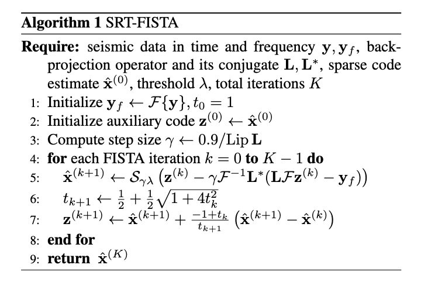
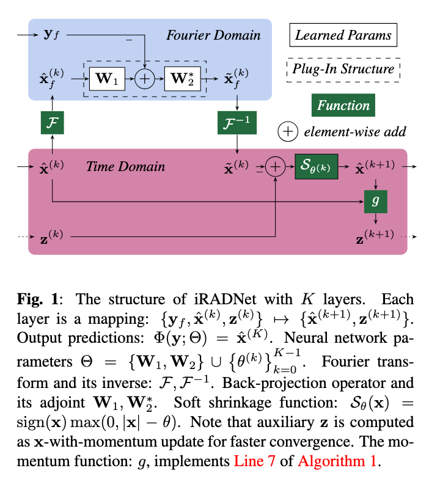

# iRADNet: Deep Algorithm Unrolling for Seismic Migration

Official implementation of iRADNet (*inverse Radon transform Network*) in paper 
[Deep Algorithm Unrolling for Seismic Migration][iRADNet]
based on the [CRISP-RF][CRISP-RF] [^USMantleTax].

[^USMantleTax]: <https://doi.org/10.1093/gji/ggad447> "On the detection of upper mantle discontinuities with radon-transformed receiver functions (CRISP-RF)"

[CRISP-RF]: <https://github.com/URseismology/CRISP-RF> "CRISP-RF: Clean Receiver-function Imaging using SParse Radon Filters"

[iRADNet]: <https://openreview.net/forum?id=hBuAes6QTt> "Deep Algorithm Unrolling for Seismic Migration"

## Problem Statement

With sparse Radon transform (SRT), we intend to approximate the following optimization problem:

```math
\mathfrak{R}_{sp}(\mathbf{y}) = \arg\min_{\mathbf{x}} \frac{1}{2}\left\lVert{\mathcal{F}^{-1}\mathbf{L} \mathcal{F} (\mathbf{x}) - \mathbf{y}}\right\rVert_2^2 + \lambda R(\mathbf{x})
```

where $\mathfrak{R}_{sp}(\mathbf{y})$ represents the sparse Radon transform of the seismic data (receiver function) $\mathbf{y}$ to give Radon model (sparse code)  $\mathbf{x}$; $\mathcal{F}$ denotes the one-dimensional Fourier transform; $\mathbf{L}$ is the complex-valued back-projection operator (reverse time-delay for wave trajectories in a finite aperture experiment);  and $R(\mathbf{x})$ is a sparsity-promoting regularizer ($\lambda > 0$); typically the $\ell_1$ norm $\left\lVert{\mathbf{x}}\right\rVert_1$, or the $\ell_1\text{-}\ell_2$ norm $\left\lVert{\mathbf{x}}\right\rVert_1 - \alpha \left\lVert{\mathbf{x}}\right\rVert_2, \alpha \geq 0$.

## SRT-FISTA/iRADNet

We introduce iRADNet by unrolling the SRT-(F)ISTA[^SRTFISTA] iterations
into a deep learning model (see Figure 1, plug-in structure
being LISTA-CP[^LISTACP], a variant of LISTA[^LISTA]) to learn the mapping
$\Phi: \mathbf{y}\mapsto\mathbf{x}$. The model consists of K layers, each analogous
to one iteration in ISTA. Setting $\mathbf{W}_1=\mathbf{W}_2=\mathbf{L}$ and 
${\theta}^{(k)} = \gamma\lambda$ reduces the network to SRT-FISTA.

[^SRTFISTA]: <https://doi.org/10.1088/1742-2132/13/4/462> "Prestack seismic data regularization using a time-variant anisotropic Radon transform"

[^LISTACP]: <https://doi.org/10.48550/arXiv.1808.10038> "Theoretical linear convergence of unfolded ISTA and its practical weights and thresholds"

[^LISTA]: <https://dl.acm.org/doi/10.5555/3104322.3104374> "Learning fast approximations of sparse coding"

<div align="center">
	
	 
</div>

## Run

```sh
# train iRADNet (LISTA-CP), using synthetic data and SNR=2
python crisprf/job/run_lista.py --train --model SRT_LISTA_CP --snr 2

# evaluate iRADNet (LISTA-CP), using synthetic data and SNR=2
python crisprf/job/run_fista.py --eval --model SRT_LISTA_CP --snr 2

# evaluate iRADNet (LISTA-CP), using synthetic data and SNR=inf
python crisprf/job/run_fista.py --eval --model SRT_LISTA_CP
```

## Cite this work

```bibtex
@inproceedings{
	wang2025deep,
	title={Deep Algorithm Unrolling for Seismic Migration},
	author={Meng Wang and Tolulope Olugboji},
	booktitle={2025 IEEE Conference on Computational Imaging Using Synthetic Apertures},
	year={2025},
	url={https://openreview.net/forum?id=hBuAes6QTt}
}
```