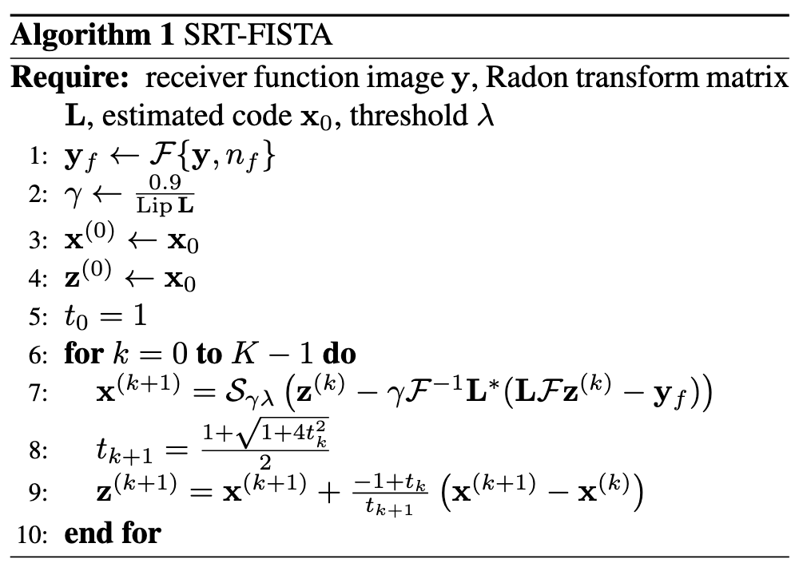
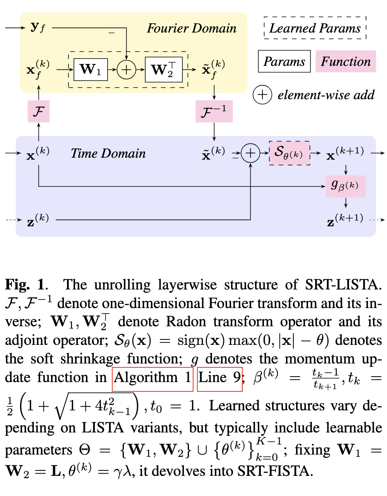

Pytorch implementation of FISTA/LISTA in the CRISP-RF [^1].

[^1]: https://doi.org/10.1093/gji/ggad447

- Matlab-FISTA: [crisprf/base/sparse_inverse_radon_fista.m][Matlab-FISTA]
- Python-FISTA: [crisprf/model/FISTA.py][Python-FISTA]

[Matlab-FISTA]: crisprf/base/sparse_inverse_radon_fista.m
[Python-FISTA]: crisprf/model/FISTA.py

With sparse Radon transform (SRT), we intend to solve the following optimization problem:

$$
\def\y{\mathbf{y}}
\def\x{\mathbf{x}}
\def\norm#1{\left\lVert #1 \right\rVert}
\def\fft{\mathcal{F}}
\def\radon{\mathbf{L}}
\mathfrak{R}_{sp}(\y) = \argmin_{\x} \frac{1}{2}\norm{\fft^{-1}\radon \fft (\x) - \y}_2^2 + \lambda R(\x)
$$

where $\mathbf{y} \in \mathbb{R}^{T\times P}$ is receiver function image, $\mathbf{x} \in \mathbb{R}^{T\times Q}$ is sparse Radon transform; $T, P, Q$ are number of time samples, number of receiver functions, and number of Radon transforms, respectively. In synthetic data, $T=5000, P=38, Q=200$.

## SRT-FISTA/LISTA

We construct SRT-LISTA by unrolling the ISTA/FISTA iterations into a DL model. If we apply constraints to substitute learned structures with static ones (i.e., $\mathbf{W}_1=\mathbf{L}, \mathbf{W}_2=\mathbf{L}^*, {\theta}^{(k)} = \gamma\lambda$), it devolves into SRT-FISTA.

<div align="center">
  
   
</div>

## Speed Comparison

||Matlab|Python|
|:-:|:-:|:-:|
|FISTA|1m2.467s|0m17.878s|

## Logs

Matlab-FISTA

```sh
$ time source crisprf/model/base/call.sh
real    1m2.467s
user    5m4.426s
sys     0m22.592s
```

Python-FISTA

```sh
$ time python crisprf/model/FISTA.py
real    0m17.878s
user    0m15.676s
sys     0m6.397s
```