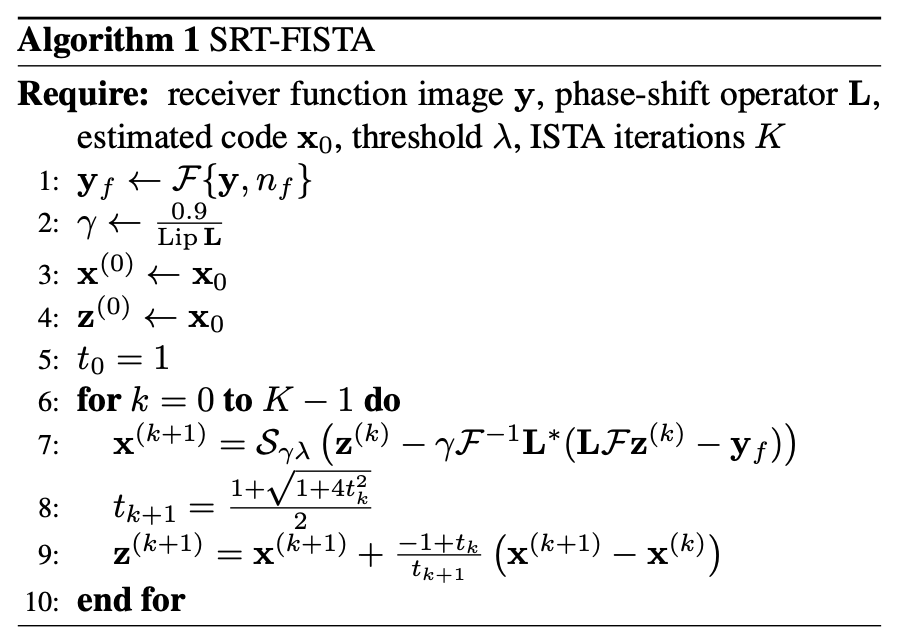

# iRADNet: Deep Algorithm Unrolling for Seismic Migration

Official Pytorch implementation of iRADNet (*inverse Radon transform Network*)  based on the CRISP-RF [^1].

[^1]: https://doi.org/10.1093/gji/ggad447

## Introduction

With sparse Radon transform (SRT), we intend to approximate the following optimization problem:

$$
\def\y{\mathbf{y}}
\def\x{\mathbf{x}}
\def\norm#1{\left\lVert #1 \right\rVert}
\def\fft{\mathcal{F}}
\def\radon{\mathbf{L}}
\mathfrak{R}_{sp}(\y) = \argmin_{\x} \frac{1}{2}\norm{\fft^{-1}\radon \fft (\x) - \y}_2^2 + \lambda R(\x)
$$

where $\mathfrak{R}_{sp}(\mathbf{y})$ represents the sparse Radon transform
of the seismic data (receiver function) $\mathbf{y}$ to give Radon
model (sparse code) $\mathbf{x}$; $\mathcal{F}$ denotes the one-dimensional
Fourier transform; $\mathbf{L}$ is the a linear phase shift operator in
the frequency domain; $\lambda >0$ is a regularization parameter; and $R(\mathbf{x})$ is the sparsity-inducing regularization term, typically the $\ell_1$ norm or the $\ell_1$-$\ell_2$ norm.

## SRT-FISTA/iRADNet

We introduce iRADNet by unrolling the (F)ISTA iterations
into a deep learning model (see Figure 1, plug-in structure
being LISTA-CP, a variant of LISTA) to learn the mapping
$\Phi: \mathbf{y}\mapsto\mathbf{x}$. The model consists of K layers, each analogous
to one iteration in ISTA. Setting $\mathbf{W}_1=\mathbf{W}_2=\mathbf{L}$ and ${\theta}^{(k)} = \gamma\lambda$ reduces the network to SRT-FISTA.

<div align="center">
  
   
</div>

## Run

```sh
python crisprf/job/run_lista.py --model SRT_LISTA_CP --snr 2
python crisprf/job/run_fista.py --snr 2
```

## Cite this work

```bibtex
TBD
```