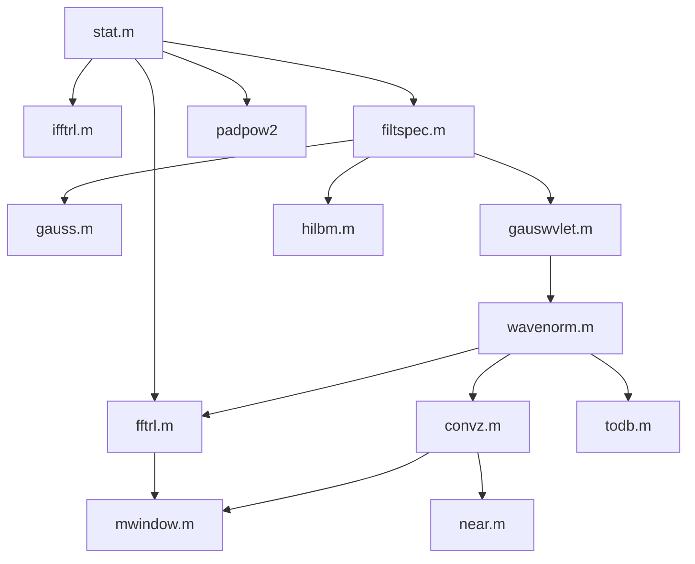

# Call Stack

```mermaid
flowchart TD
    gauss[gauss.m]
    gwave[gauswvlet.m] 
    wavenorm[wavenorm.m]
    convz[convz.m]
    F[fftrl.m]
    IF[ifftrl.m]
    fspec[filtspec.m]

    gwave --> wavenorm
    wavenorm --> convz
    wavenorm --> F

    fspec --> gauss
    fspec --> gwave

    stat[stat.m]
    stat --> F
    stat --> IF
    stat --> fspec

    mwindow[mwindow.m]
    convz --> mwindow
    F --> mwindow

    near[near.m]
    convz --> near

    todb[todb.m]
    wavenorm --> todb

    hilbm[hilbm.m]
    fspec --> hilbm

    padpow2[padpow2]
    stat --> padpow2
```